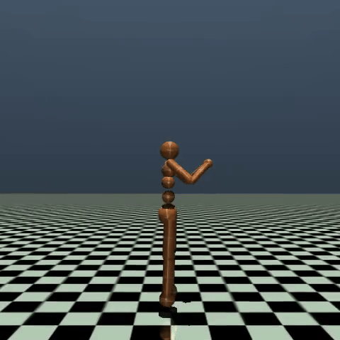

# Reinforcement Learning with Gymnasium and Stable Baselines3

This repository provides an implementation of **Reinforcement Learning (RL)** for controlling agents in a simulated environment using the **Gymnasium** library and **Stable Baselines3** algorithms. We use **SAC (Soft Actor-Critic)**, **TD3 (Twin Delayed Deep Deterministic Policy Gradient)**, and **A2C (Advantage Actor-Critic)** to train and test agents in continuous action space environments.

## Overview

The aim of this project is to implement and compare different RL algorithms for training agents to solve complex control problems. These algorithms are capable of learning policies for continuous state-action spaces, often required for robotics or control tasks like the **Humanoid-v4** environment.

### Key Concepts:

1. **Reinforcement Learning (RL)**: RL is a branch of machine learning where agents learn to make decisions by interacting with an environment. The agent receives rewards based on the outcomes of its actions and aims to maximize the cumulative reward over time.

2. **Gymnasium Environment**: Gymnasium is a toolkit for developing and comparing RL algorithms. It provides various environments where agents can interact and learn.

3. **Stable Baselines3 Algorithms**:
   - **SAC (Soft Actor-Critic)**: An off-policy actor-critic RL algorithm that optimizes a stochastic policy in an off-policy way. It aims to maximize both the expected reward and entropy, making it suitable for continuous action spaces.
   - **TD3 (Twin Delayed Deep Deterministic Policy Gradient)**: A variation of the DDPG algorithm with modifications like twin Q-networks and delayed policy updates to reduce the overestimation bias.
   - **A2C (Advantage Actor-Critic)**: A synchronous, deterministic version of the Asynchronous Advantage Actor-Critic (A3C) algorithm that optimizes both the value and policy functions simultaneously.

## File Structure

- **`train()`**: The function responsible for training the agent. It initializes the chosen algorithm, sets up logging, and iteratively trains the model in steps.
- **`test()`**: This function loads a trained model and runs the agent in the environment to evaluate its performance.
- **`models/`**: The directory where trained models are saved after each training iteration.
- **`logs/`**: The directory used for tensorboard logging of training metrics.

## Algorithms

### 1. **Soft Actor-Critic (SAC)**
- **Purpose**: It learns a stochastic policy that maximizes a trade-off between expected reward and entropy.
- **Formula**: SAC optimizes a policy $\pi$ to maximize:
  $$
  \mathbb{E}_{(s, a) \sim D} \left[ Q(s,a) - \alpha \log \pi(a|s) \right]
  $$
  where $Q(s,a)$ is the value function, and $\alpha$ is the entropy coefficient.

### 2. **Twin Delayed Deep Deterministic Policy Gradient (TD3)**
- **Purpose**: It reduces overestimation bias by using two Q-value estimators and delayed policy updates.
- **Key Advantage**: TD3 avoids large policy changes by updating the actor less frequently than the critic, stabilizing the learning process.

### 3. **Advantage Actor-Critic (A2C)**
- **Purpose**: It balances between policy and value updates by calculating the advantage function:
  $$
  A(s, a) = Q(s, a) - V(s)
  $$
  where $Q(s, a)$ is the state-action value and $V(s)$ is the state value.

## How to Use

### 1. Training

To train the agent in the desired environment using a specific algorithm, run the following command in your terminal:

```bash
python inverse_kinematic.py --ik-method SAC
```
Replace SAC with TD3 or A2C to use other algorithms. By default, the agent will be trained in the Humanoid-v4 environment.

# 2. Testing
To test a previously trained model, specify the model path and run:

```bash
Copy code
python inverse_kinematic.py --ik-method SAC --model-path models/SAC_25000.zip
```

This will load the trained model and visualize the agent’s performance in the environment.

# Performance Video

